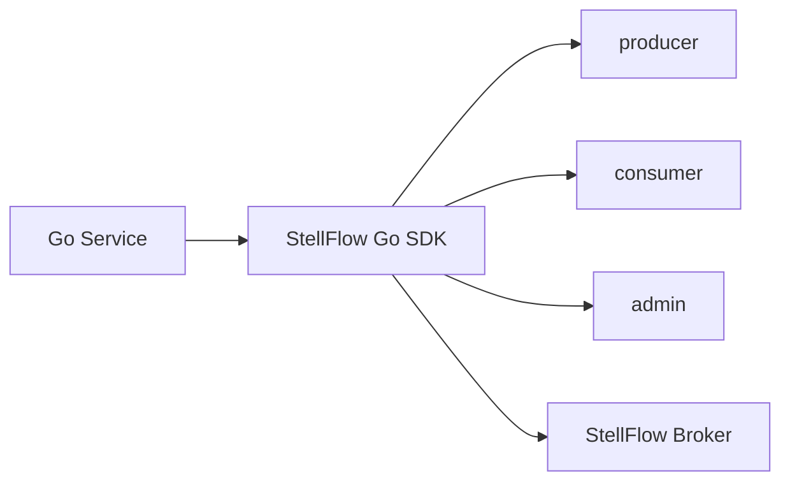

# StellFlow Go SDK

`stellflow-go-sdk` 是 StellFlow 的 Go 客户端 SDK，用于对接 StellFlow Broker 数据面协议，为 Go 应用提供 Producer、Consumer、Admin 与协议编解码能力。

## 项目概述

本仓库面向 Go 服务和基础设施组件，封装 StellFlow 的消息发送、消息消费、元数据发现、位点管理和管理接口。Go SDK 应与 Java SDK 保持协议语义一致，但实现方式遵循 Go 语言习惯。

## 当前状态

| 项目 | 说明 |
| --- | --- |
| 稳定性 | 开发中 |
| 适用对象 | Go 服务、网关、平台组件 |
| 核心能力 | Producer、Consumer、Admin、Protocol、Transport |
| 维护方 | StellHub |

## 解决什么问题

- 提供 Go 侧消息发送能力。
- 提供 Go 侧消息消费能力。
- 封装 Topic、Partition、Offset 等基础语义。
- 提供协议编解码、连接管理和请求关联能力。
- 与 Java SDK 保持跨语言协议一致性。

## 不解决什么问题

- 不实现 StellFlow 服务端。
- 不承诺兼容 Kafka 客户端协议。
- 不负责业务消息模型设计。

## 核心能力

| 能力 | 说明 |
| --- | --- |
| producer | 消息发送、分区路由、重试 |
| consumer | 消息拉取、位点管理、消费组能力 |
| admin | Topic 与集群管理接口 |
| protocol | 请求和响应编解码 |
| transport | TCP 长连接、请求关联、重连 |

## 架构说明



## 快速开始

```bash
go get github.com/stellhub/stellflow-go-sdk
```

```go
producer := producer.New(config)
err := producer.Send(ctx, record)
```

## 配置说明

| 配置项 | 是否必填 | 说明 |
| --- | --- | --- |
| bootstrap.servers | 是 | Broker 地址列表 |
| client.id | 否 | 客户端标识 |
| request.timeout | 否 | 请求超时时间 |
| retries | 否 | 重试次数 |

## 本地开发

```bash
go test ./...
go vet ./...
go build ./...
```

## 版本与升级

- `MAJOR`：不兼容 API 或协议变更。
- `MINOR`：向后兼容的新能力。
- `PATCH`：向后兼容的问题修复。

## 可观测性

| 类型 | 名称 | 说明 |
| --- | --- | --- |
| Metric | stellflow_client_request_total | 客户端请求数 |
| Metric | stellflow_client_request_latency | 请求耗时 |
| Log | REQUEST_FAILED | 请求失败 |
| Log | CONNECTION_RECONNECT | 连接重建 |

## 故障排查

### 发送失败

1. 检查 Broker 地址是否正确。
2. 检查 Topic 是否存在。
3. 检查协议版本是否匹配。
4. 检查网络连接和超时配置。

## 安全说明

生产环境配置不应直接提交到仓库，客户端日志应遵守平台数据规范。

## 目录结构

```text
.
├── producer/       # Producer 实现
├── consumer/       # Consumer 实现
├── admin/          # Admin Client
├── protocol/       # 协议编解码
├── transport/      # 网络层
├── go.mod          # Go module
└── README.md       # 项目说明
```

## 贡献规范

- 协议和公共 API 变更必须说明兼容性影响。
- 网络层、编解码和重试逻辑变更必须补充测试。
- 行为变更必须同步更新 README 或 docs。

## 支持

由 StellHub 维护。建议通过 GitHub Issues 记录问题、需求和设计讨论。

## 许可证

以仓库内 `LICENSE` 文件为准。